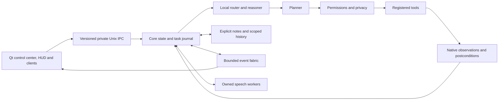

# How Carlos fits together

One user-owned Core coordinates the assistant. It owns memory, permissions,
task receipts and state. Models propose actions; the executor checks and runs
them. A reply saying something happened does not count as verification.

## Source map

Paths below are relative to `carlos/core/ev`.

| Area | Implementation | Boundary |
| --- | --- | --- |
| Coordination | `service.py`, `state.py`, `ipc/` | One session owner; private socket; responsive stop requests |
| Events | `events.py`, `identity.py`, `priority.py` | Correlation IDs, version 1 envelopes, bounded queues and observed drop counts; canonical names retain legacy routing types |
| Reasoning | `brain.py`, `ai/carlos_router.py`, `ai/local_llama.py` | Local-first; cloud requires its configured policy; inference does not authorize effects |
| Planning | `planner.py`, `goals.py`, `execution.py`, `task_wait.py` | Shared executor, finite budgets, observed steps, explicit waits and postconditions |
| Tools | `tools/base.py`, `tools/results.py`, `capabilities.py` | Input/output validation, deadlines, capability evidence and conservative execution receipts |
| Permissions | `permissions.py`, `privacy.py`, `action_claims.py` | Execution-time gates; one-use scoped approvals; stale approvals are refused |
| Memory | `memory/store.py`, `timeline.py`, `task_journal.py` | Core-owned SQLite; explicit notes; exact committed readback; optional metadata history; private session storage in RAM |
| Voice | `voice/` | Separate owned VAD, wake, STT and TTS workers; cancellation joins cleanup; microphone privacy is independent of model privacy |
| Desktop | `desktop/`, `accessibility.py`, `vision.py`, `recording.py` | Native KWin/AT-SPI and portal grants; capture on demand; descriptions alone cannot authorize coordinate clicks |
| Presence and scenes | `presence.py`, `session_lock.py`, `scenes.py`, `proactive.py` | Observed session state; no guessed identity; scenes use the same tool gates; fresh policy-scoped alerts |
| Engineering | `coding_agent.py`, `coding_wait.py` | Read-only proposal, separately approved isolated worktree job, fixed validators and review commit; deployment remains a separate reviewed action |
| Recovery | `health.py`, `lifecycle.py`, `readiness.py` | Owned bounded repair attempts; expired health cannot prove readiness; no spontaneous source rewrite |
| Resources | `telemetry.py`, `core_resources.py`, `hardware_metrics.py`, `gaming.py` | Measured CPU/PSS, thermal limits, idle model release and ambient gaming yield |
| Power and settings | `daily.py`, `settings_center.py`, `tools/power_profiles.py` | Cancellable power intents and guarded setting undo; missing native authorization remains a setup gap |
| Extensions | `plugins.py` | Explicit installed `carlos.tools` entry points with `plugin.<name>.` tool scope; disabled extensions are not imported |
| Sentinel | `sentinel/` | Minimal authenticated status/wake reference; no model or private-memory replica |

The Qt UI and pet live in `carlos/ui`. They consume observed state, not model
progress estimates. Desktop widgets, themes and operating-system services are
outside Core's ownership.

## Process and recovery ownership

The user session starts Core through XDG autostart and D-Bus activation. No
root daemon is required for normal assistant work. The HUD, pet and optional
mobile backend are separate processes. Speech, model, OCR and recording
children have their own bounded lifetimes. Core only repairs components it
owns; a healthy listener at a configured port is not proof of ownership.

Cancellation prevents later steps and joins owned cleanup. Effects already
dispatched to an application or operating-system service may complete, so
their receipts retain that uncertainty. Repairing an IPC connection does not
replay an earlier mutation. Source updates require a diff, validation, staged
checks and an explicit activation decision. Installed backups and rollback
scripts remain separate from automatic health repair.

## Clients and protocols

Core's local IPC and serialized events are version 1. Compatibility identifiers
remain `ev`, `com.ev.Core` and `ev.sock`; renaming these would break installed
clients without improving the public Carlos name.

HoloHand and Carlos Mobile are separate source trees and are not bundled into
this assistant-only release. Mobile routes assistant requests to this same
Core and uses a versioned API, paired browser/device sessions, origin checks
and one-use sensitive-action confirmations. Desktop gateways stay on loopback
behind the authenticated web transport. Mobile owns its coding-app sessions;
that bridge and Core's isolated engineering jobs have different ownership
boundaries and do not share unchecked approval tokens.

The Sentinel reference uses version 1 signed requests and request-bound signed
responses. Its heartbeat state is minimal and expires; an accepted wake packet
is not an online host. See [SENTINEL.md](SENTINEL.md). No independent physical
Sentinel is claimed installed.

Core keeps deep memory. A client receives only requested, policy-permitted
results. Sentinel receives no conversation database, room audio or project
notes. Future node/device interfaces are described in
[ROOM-DESIGN.md](ROOM-DESIGN.md); they are designs, not available devices.

## Current limits

The catalogue still exposes incomplete declarations rather than pretending all
tools have finished output/offline/undo contracts. Registered capability is
separate from successful execution and physical acceptance. KDE desktop
automation is not portable to every compositor; unsupported backends refuse.
See [STATUS.md](STATUS.md), [VALIDATION.md](VALIDATION.md) and
[LINUX.md](LINUX.md) for the actual tested scope.
